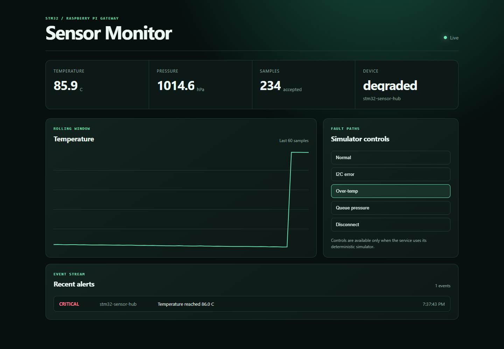
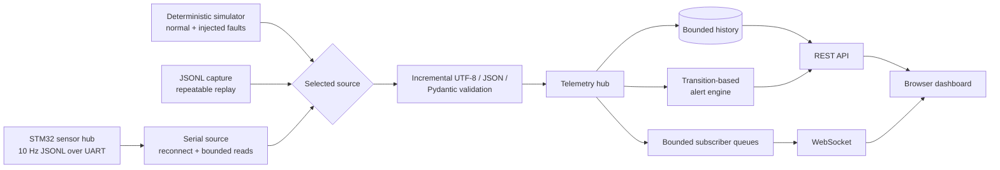
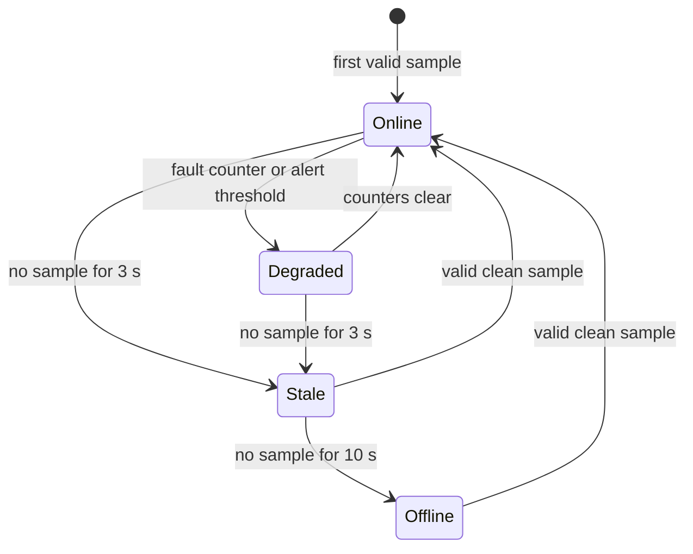

# Networked Embedded Sensor Monitoring System

[](https://github.com/RohitPatel97/networked-embedded-sensor-monitor/actions/workflows/ci.yml)
[](https://www.python.org/)
[](https://fastapi.tiangolo.com/)
[](LICENSE)

A Raspberry Pi-class gateway that turns newline-delimited STM32 UART telemetry into a validated, observable network service. It provides REST history, live WebSocket updates, device-health state, transition-based alerts, rotating logs, and a zero-dependency browser dashboard. A deterministic simulator and JSONL replay source make every software path demonstrable without attached hardware.

> **Validation boundary:** the simulator, parser, API, alert, state, and WebSocket paths are automated and runnable on any development machine. The serial adapter and systemd unit are implementation-ready reference paths; this repository does not claim that the current revision was exercised on a physical STM32 or Raspberry Pi.



_Deterministic simulator with an over-temperature fault injected through the live dashboard._

## What this demonstrates

| Engineering claim | Evidence in this repository |
| --- | --- |
| STM32 telemetry integration | Versioned, bounded UART JSON protocol and `SerialSource` adapter |
| REST and WebSocket APIs | Typed FastAPI routes, OpenAPI at `/docs`, and bounded live fan-out |
| Application-simulator fallback | Seeded 10 Hz simulator with five runtime fault modes |
| Device health and alerts | Online/degraded/stale/offline state machine and transition-only alert engine |
| Operational deployment | Rotating logs, an unprivileged hardened systemd unit, Docker health check, and smoke test |
| Repeatable validation | Unit/integration suite, replay fixture, CLI schema validator, and multi-version CI |

## Problem, solution, and regression evidence

| Problem / failure stimulus | Implemented solution | Executable evidence |
| --- | --- | --- |
| A duplicate or old hot sample could replace history, refresh health, and raise a false alarm | Reject it before persistence, alerts, and WebSocket fan-out; retain the accepted sequence baseline | `tests/test_store.py::test_rejected_sequence_cannot_refresh_health_or_replace_history`, `tests/test_hub.py::test_duplicate_and_old_fault_frames_cannot_raise_alerts_or_reach_subscribers` |
| A 32-bit firmware sequence wraps from 4294967295 to 0 | Unsigned serial-number comparison accepts wrap; rejects ambiguous half-range jumps | `tests/test_store.py::test_uint32_rollover_is_fresh_but_old_pre_wrap_frame_is_rejected` |
| A slow browser could stop acquisition | Bounded per-client queues discard the oldest update and count the loss | `tests/test_hub.py::test_slow_subscriber_drops_oldest_without_blocking` |
| Corrupt or oversized UART input could hide later valid frames | Bounded incremental decoder resynchronizes at the next newline | `tests/test_protocol.py::test_event_decoder_recovers_around_malformed_frames`, `test_oversized_tail_is_discarded_until_delimiter` |
| Unbounded device IDs could defeat per-device memory limits | Enforce a configurable device-count cap while allowing existing devices | `tests/test_store.py::test_device_count_is_bounded_without_rejecting_existing_device` |
| Acquisition ends or crashes while HTTP stays alive | Readiness returns HTTP 503 when acquisition is no longer running | `tests/test_api.py::test_readiness_fails_when_source_has_finished`, `test_readiness_fails_when_source_crashes` |
| An oversized capture passed the CLI validator but failed live ingestion | Share the live decoder and enforce the same byte limit, including CRLF and final-line cases | `tests/test_cli.py::test_validate_enforces_uart_byte_limit`, `test_validate_recovers_and_reports_physical_line_numbers` |
| Replaying a large capture loaded the entire file into memory | Read bounded records, drain oversized lines, and recover at the next LF | `tests/test_sources.py::test_replay_reads_large_capture_in_bounded_pieces`, `tests/test_hub.py::test_replay_rejects_oversized_fault_without_alerts_and_recovers` |

Architecture, wire protocol, API contracts, deployment, and validation boundaries follow below. [WORKFLOW.md](WORKFLOW.md) records completed work and next tasks.

## Quick start - no hardware required

Python 3.11 or newer is required. Clone the repository, then use the commands for your shell:

```bash
git clone https://github.com/RohitPatel97/networked-embedded-sensor-monitor.git
cd networked-embedded-sensor-monitor
```

Linux/macOS:

```bash
python -m venv .venv
source .venv/bin/activate
python -m pip install -e ".[dev]"
sensor-monitor serve
```

Windows PowerShell (activation is optional):

```powershell
python -m venv .venv
.\.venv\Scripts\python.exe -m pip install -e ".[dev]"
.\.venv\Scripts\sensor-monitor.exe serve
```

Open <http://127.0.0.1:8000> for the dashboard or <http://127.0.0.1:8000/docs> for interactive API documentation. Simulator telemetry begins immediately.

Exercise a fault path from the dashboard or with `curl`:

```bash
curl -X POST http://127.0.0.1:8000/api/v1/simulator/fault \
  -H "content-type: application/json" \
  -d '{"mode":"over_temperature"}'

curl -X POST http://127.0.0.1:8000/api/v1/simulator/fault \
  -H "content-type: application/json" \
  -d '{"mode":"normal"}'
```

Available modes are `normal`, `disconnected`, `i2c_error`, `over_temperature`, and `queue_pressure`. Alerts are edge-triggered: a fault produces one active event and returning to normal produces one recovery event, rather than repeating the same alert ten times per second.

## Architecture



The acquisition loop is independent of HTTP clients. A slow WebSocket consumer cannot block UART ingestion: each subscriber gets a bounded queue, and the oldest pending update is discarded under backpressure while `websocket_drops` records the event. Telemetry and alert histories use bounded deques so the process has a predictable memory ceiling.

## UART wire protocol

The transport is UTF-8, newline-delimited JSON at 115200 baud by default. One line is one telemetry sample. The schema rejects unknown fields, invalid identifiers, out-of-range sensor values, invalid UTF-8, and malformed JSON. The frame limit is **2048 bytes before LF**; a CR in a CRLF ending counts toward that limit. Empty LF/CRLF lines are ignored; lines containing only spaces or tabs are rejected as invalid JSON.

```json
{"schema_version":1,"device_id":"stm32-sensor-hub","sequence":122,"uptime_ms":12200,"temperature_c":24.66,"pressure_hpa":1013.23,"accel_g":[0.004,-0.004,1.002],"battery_v":12.41,"i2c_errors":0,"queue_drops":0,"watchdog_resets":0}
```

| Field | Type / range | Purpose |
| --- | --- | --- |
| `schema_version` | integer, currently `1` | Explicit compatibility boundary |
| `device_id` | 1-64 safe identifier characters | Stable device key in URLs and histories |
| `sequence` | unsigned 32-bit integer | Duplicate/out-of-order detection |
| `uptime_ms` | non-negative integer | Firmware-local time and reset visibility |
| `temperature_c` | -50 to 150 | Calibrated temperature |
| `pressure_hpa` | 300 to 1200 | Barometric pressure |
| `accel_g` | three axes, each +/-16 | MPU-class acceleration vector |
| `battery_v` | optional, 0 to 30 | Supply/battery monitoring |
| `i2c_errors` | non-negative counter | Sensor-bus fault visibility |
| `queue_drops` | non-negative counter | Firmware backpressure visibility |
| `watchdog_resets` | non-negative counter | Task-health recovery visibility |

Sequence freshness uses `(new - previous) mod 2^32`: deltas from 1 through 2147483647 are forward progress. Zero, backward, and exactly half-range deltas are rejected and counted in `sequence_anomalies`. Rejected samples do not affect history, health age, alerts, or subscribers. The protocol has no authenticated boot/session identifier, so it cannot safely distinguish a device reboot from delayed old data. After a firmware sequence reset, restart the gateway or assign a new device ID to establish a fresh baseline. Do not use this protocol as a security replay-prevention mechanism.

Validate a capture without starting the server:

```bash
sensor-monitor validate examples/telemetry.jsonl
# accepted=3 rejected=0
```

The validator uses the same framing and schema checks as live ingestion. It reports errors with physical file line numbers, counts each oversized record once, continues to later valid records, and exits with status `1` if any record is rejected (`0` otherwise). File validation and replay use bounded reads, including for a single oversized line, and accept a final record without LF. Oversized records are drained through the next LF and only a bounded prefix is retained for rejection.

This command checks framing and schema only. Duplicate sequences, out-of-order samples, device capacity, and alert transitions are evaluated by the running gateway; `accepted` here does not certify those stateful checks.

## API surface

| Method | Path | Behavior |
| --- | --- | --- |
| `GET` | `/healthz` | Lightweight process/source readiness check |
| `GET` | `/api/v1/snapshot` | Health, recent alerts, and service counters in one request |
| `GET` | `/api/v1/devices` | Current health for every observed device |
| `GET` | `/api/v1/devices/{id}` | One device's current state |
| `GET` | `/api/v1/devices/{id}/readings?limit=100` | Bounded chronological history |
| `GET` | `/api/v1/alerts?limit=50` | Most recent alert transitions first |
| `GET` | `/api/v1/stats` | Ingestion, validation, sequence, and fan-out counters |
| `POST` | `/api/v1/simulator/fault` | Select a demo fault; rejected outside simulator mode |
| `WS` | `/ws/telemetry` | Initial snapshot, live samples/alerts, then idle heartbeats |

FastAPI generates the exact OpenAPI schema from the response models. Invalid query limits and fault modes receive structured 422 responses; unknown devices return 404; simulator control on a real serial source returns 409.

## Health and fault policy



Timeouts and thresholds are environment-configurable. Temperature, low-battery, I2C-error, and queue-drop conditions produce an alert on transition into the condition and an informational recovery event on transition out. A critical temperature suppresses the redundant warning condition.

## Source modes

### Deterministic simulator

This is the default. It emits repeatable temperature, pressure, and accelerometer signals at 10 Hz. The seed and sample rate can be changed without editing code:

```bash
SENSOR_MONITOR_SIMULATOR_SEED=21 \
SENSOR_MONITOR_SIMULATOR_RATE_HZ=25 \
sensor-monitor serve
```

### JSONL replay

Replay a captured session once to reproduce integration behavior:

```bash
SENSOR_MONITOR_SOURCE=replay \
SENSOR_MONITOR_REPLAY_FILE=examples/telemetry.jsonl \
SENSOR_MONITOR_REPLAY_LOOP=false \
sensor-monitor serve
```

Windows PowerShell:

```powershell
$env:SENSOR_MONITOR_SOURCE = "replay"
$env:SENSOR_MONITOR_REPLAY_FILE = "examples/telemetry.jsonl"
$env:SENSOR_MONITOR_REPLAY_LOOP = "false"
.\.venv\Scripts\sensor-monitor.exe serve
```

Replay streams the capture with bounded memory and preserves its sequence numbers, uptime, and sensor values. Once a one-pass capture ends, `/healthz` returns `503` because acquisition has finished; REST history remains available until shutdown. A new gateway process starts with empty history and sequence baselines.

`SENSOR_MONITOR_REPLAY_LOOP` defaults to `true` for compatibility. When enabled, it rereads the original records without resetting sequence baselines. Repeating the bundled capture accepts three samples on the first pass and rejects all three on each later pass as sequence anomalies; health then ages to stale/offline. Use simulator mode for an ongoing live demo. Set `SENSOR_MONITOR_SOURCE=simulator` in a new shell, or `$env:SENSOR_MONITOR_SOURCE = "simulator"` in PowerShell, before restarting the demo.

### STM32 serial input

Give the service user access to the serial group, connect the UART through a 3.3 V USB adapter, and select the device:

```bash
sudo usermod -aG dialout sensor-monitor
SENSOR_MONITOR_SOURCE=serial \
SENSOR_MONITOR_SERIAL_PORT=/dev/ttyUSB0 \
SENSOR_MONITOR_BAUD_RATE=115200 \
sensor-monitor serve
```

Use a common ground and 3.3 V logic levels. A typical receive-only gateway connection is STM32 UART TX -> adapter RX plus GND -> GND. Board pin selection belongs in the STM32 firmware configuration; it is intentionally not hard-coded here.

## Configuration

Copy `.env.example` into your service manager or shell environment. Important controls:

| Variable | Default | Meaning |
| --- | --- | --- |
| `SENSOR_MONITOR_SOURCE` | `simulator` | `simulator`, `serial`, or `replay` |
| `SENSOR_MONITOR_SERIAL_PORT` | `/dev/ttyUSB0` | UART device used in serial mode |
| `SENSOR_MONITOR_HISTORY_SIZE` | `600` | Samples retained per device |
| `SENSOR_MONITOR_STALE_AFTER_SECONDS` | `3` | Transition from current to stale |
| `SENSOR_MONITOR_OFFLINE_AFTER_SECONDS` | `10` | Transition from stale to offline |
| `SENSOR_MONITOR_SUBSCRIBER_QUEUE_SIZE` | `64` | Per-client WebSocket backlog |
| `SENSOR_MONITOR_LOG_DIR` | `var/log` | Rotating log destination |

All supported variables and threshold defaults are documented in [`.env.example`](.env.example).

## Verification

```bash
python -m pip install -e ".[dev]"
ruff check .
pytest --cov=sensor_monitor --cov-report=term-missing
sensor-monitor validate examples/telemetry.jsonl
```

| Test area | Representative cases |
| --- | --- |
| Framing | fragmented reads, multiple frames per chunk, CRLF, bounded buffer |
| Input rejection | malformed JSON, invalid UTF-8, missing fields, unsafe device IDs |
| Alert behavior | critical threshold, independent counters, no repeated spam, recovery |
| State | bounded history, duplicate/backward sequence, online/stale/offline timeouts |
| Network API | REST success/404, simulator fault endpoint, WebSocket snapshot and update |
| Capture files | bounded reads, shared live/CLI frame limits, physical error line numbers, recovery after malformed or oversized records, and optional final newline |
| CLI | capture validation exit status and generated firmware-shaped JSONL |

CI runs lint and the full suite on Python 3.11, 3.12, and 3.13, then independently builds the production container.

Local verification on October 1, 2026: Python 3.12.14 on Windows, **69 tests passed**, **94.16% combined line/branch coverage**, `ruff check .` passed, and sample validation reported `accepted=3 rejected=0`. The suite includes generated captures and mocked file I/O; the serial hardware path and Raspberry Pi deployment were not exercised. One upstream Starlette/httpx deprecation warning was emitted by the test client. Published commit and observed CI results are recorded in [WORKFLOW.md](WORKFLOW.md); CI configuration alone is not proof of a successful run.

## Deployment

### Docker

```bash
docker compose up --build
python scripts/smoke_test.py http://127.0.0.1:8000
```

For physical serial access, map the device into the container and set serial mode. On Linux, add under the service in `compose.yaml`:

```yaml
devices:
  - /dev/ttyUSB0:/dev/ttyUSB0
environment:
  SENSOR_MONITOR_SOURCE: serial
```

### Raspberry Pi / systemd

Install the repository at `/opt/sensor-monitor`, create an unprivileged `sensor-monitor` user, then run:

```bash
sudo install -m 0644 deploy/sensor-monitor.service /etc/systemd/system/
sudo systemctl daemon-reload
sudo systemctl enable --now sensor-monitor
journalctl -u sensor-monitor -f
```

The supplied unit restarts on failure and enables `NoNewPrivileges`, `ProtectSystem=strict`, `ProtectHome`, and a private temporary directory. `/var/log/sensor-monitor` is its only writable application path. Review the group and device policy for the target distribution before deployment.

## Design decisions

- **Newline JSON over a binary packet:** easy to inspect during bring-up and resilient to a dropped line. The size cap offsets JSON's otherwise unbounded framing risk. A high-bandwidth production system could swap the decoder behind the same source interface.
- **Host receive time plus firmware uptime:** receive time supports network health while uptime exposes resets; pretending unsynchronized MCU time is wall-clock time would be misleading.
- **In-memory bounded history:** predictable and sufficient for live monitoring. Persistent time-series storage is deliberately outside this gateway's scope.
- **Strict schema:** bad data fails at the boundary instead of contaminating dashboards and alerts. The `schema_version` field supports a deliberate future migration.
- **One acquisition task:** serial ownership stays simple. Slow clients are isolated through per-subscriber queues and observable drop counters.
- **Dependency-free frontend:** the dashboard ships inside the Python wheel and runs without a Node build chain or external CDN.

## Repository map

```text
.
|-- src/sensor_monitor/
|   |-- app.py             # FastAPI routes, lifespan, WebSocket
|   |-- hub.py             # acquisition and bounded fan-out
|   |-- protocol.py        # strict incremental JSONL decoder
|   |-- capture.py         # bounded capture records for validation/replay
|   |-- sources.py         # serial, simulator, and replay inputs
|   |-- store.py           # bounded concurrency-safe history
|   |-- alerts.py          # transition-based fault policy
|   `-- web/               # bundled live dashboard
|-- tests/                 # unit and integration tests
|-- examples/              # versioned telemetry capture
|-- deploy/                # hardened systemd unit
|-- scripts/               # install and smoke-test helpers
|-- Dockerfile
`-- .github/workflows/ci.yml
```

## Current limitations and next hardware steps

- API authentication and TLS are not built into the service. Use an authenticated reverse proxy before leaving a trusted lab network.
- History is intentionally ephemeral. Add a TimescaleDB, SQLite, or MQTT sink if retention across restarts is required.
- An explicit boot/session policy and a bridge to the separate FreeRTOS telemetry schema remain pending; matching hardware names do not establish wire compatibility.
- The serial reader reconnects after OS/driver errors and exposes an attempt counter, but production alert routing for repeated reconnects is outside this first release.
- Transport reconnects currently preserve decoder state. A partial or oversized frame before disconnect can cause the first record after reconnect to be rejected; resetting framing at transport boundaries remains a follow-up.
- Before declaring target validation complete, capture a long-running STM32 session, replay it through the validator, run serial disconnect/reconnect tests on the Pi, confirm service restart behavior, and record CPU/memory/latency measurements with the exact board and image revision.

## License

[MIT](LICENSE) - Copyright (c) 2026 Rohit Patel.
